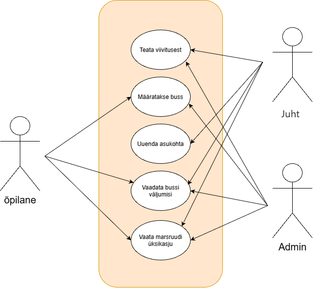
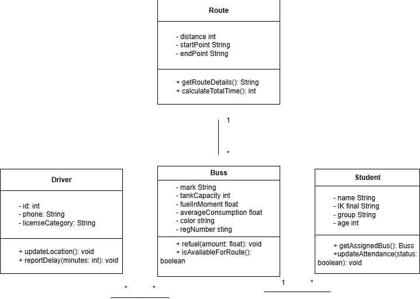
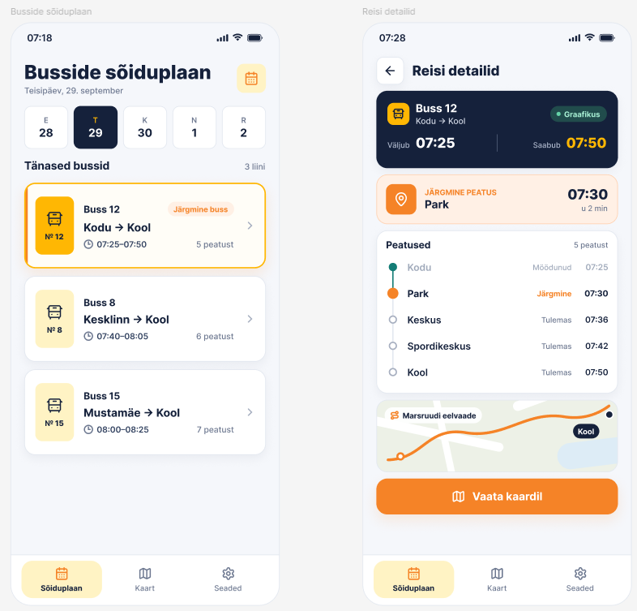
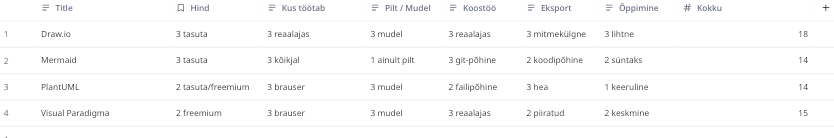

# Koolibussi graafik

Süsteem, mille abil õpilased saavad vaadata väljumisi ja peatusi ning juhid või dispetšerid saavad märkida hilinemisi ja hallata liine.

**Tegijad:** Danil Razskazov, Ivan Petrash NPTV24

## Kasutajad ja nõuded
Kaks rolli: õpilane/lapsevanem ja bussijuht/dispetšer. Kuus kasutajalugu on Issues all, tähtsamad on märgitud `must`.

## Arendusmudel
Koolibussi-graafiku projekti jaoks valiksin inkrementaalse mudeli, sest süsteemi saab arendada väikeste osadena. Esmalt saab luua põhilise bussigraafiku ning seejärel lisada näiteks peatuste, õpilaste ja busside haldamise. Iga valminud osa saab eraldi testida ja vajadusel parandada. Kosemudel ei oleks sama sobiv, sest seal on hilisemate muudatuste tegemine keerulisem. Inkrementaalne mudel võimaldab projekti jooksul paindlikult uusi vajadusi arvesse võtta.

## Diagrammid


sequenceDiagram
    autonumber
    actor Kasutaja
    participant MeieSüsteem as Teie süsteem (Koolibuss)
    participant VanaSüsteem as Võõras süsteem (Kooli infosüsteem)

    Kasutaja->>MeieSüsteem: Avab lehe ja vajutab "Sünkroniseeri õpilased"
    MeieSüsteem->>VanaSüsteem: API päring (OAuth2 token, school_id=12, route_id=5)
    
    alt Võõras süsteem vastab edukalt
        VanaSüsteem-->>MeieSüsteem: JSON (student_id, name, class, assigned_stop_id)
        MeieSüsteem-->>Kasutaja: Kuvab õpilaste nimekirja ja eduka sünkroniseerimise teate
    else Võõras süsteem ei vasta 10 sekundi jooksul VÕI vastab veaga (timeout / 500 Error)
        VanaSüsteem--xMeieSüsteem: Aegumine / Viga
        MeieSüsteem-->>Kasutaja: "Kooli infosüsteem ei vasta. Proovi hiljem uuesti või kasuta vahemälu."
    end

## Projekti tüübid
## 📋 Projekti tüübid

- **Uus süsteem (New System):** Toote algne loomine nullist (MVP või täislahendus)[cite: 1].
- **Üleviimine (Migration / Replacement):** Vana aegunud tehnoloogia, aegunud raamkestade või toeta jäänud tarkvara asendamine uuega[cite: 1].
- **Liidestamine (Integration):** Välise teenuse, API või makselahenduse ühendamine olemasolevasse süsteemi[cite: 1].
- **Olemasoleva arendus (Enhancement / Maintenance):** Uute funktsioonide lisamine ja äriloogika laiendamine töötavasse süsteemi[cite: 1].

---

## 🚀 Kaheaastase tööjärgse arenduse stsenaariumid

### (a) Uus funktsioon: Hääl-/visuaalne assistendi tugi (Häälassistent)
- **Tüüp:** olemasoleva süsteemi arendus
- **Mis muutub:** `ParentNotificationController`, `NotificationService`, ekraan `BusStatusScreen` (lisandub otsetee nupp).
- **Mis jääb samaks:** GPS-i jälgimise põhimoodul, `BusTrackerService` ja andmebaasi baasstruktuur (bussid, marsruudid).
- **Peamine risk:** Uus teavituste loogika võib tekitada duplikaat-push-teateid vanematele, kui taustateenuste sünkroniseerimine tõrgub.
- **Esimene samm:** Kirjutada olemasolevale koodile automaattestid (unit tests) praeguse teavituste süsteemi katmiseks, et uus funktsioon ei rikuks olemasolevat tööd.

> **Klassidiagrammi muudatused:**
> * *Muutuvad klassid:* `NotificationService` (lisandub uus meetod häälassistendi päringute töötlemiseks) ja `BusStatusScreen` (UI kiht).
> * *Uus klass:* `VoiceAssistantAdapter` (haldab ühendust väliste hääljuhtimise API-dega).

---

### (b) Platvorm vananes: Üleminek uuele tehnoloogiale
- **Tüüp:** üleviimine
- **Mis muutub:** Kogu backend-arhitektuur (PHP 5 / vana server -> Node.js + PostgreSQL) ja serveri keskkond.
- **Mis jääb samaks:** Välised API-d, mobiilirakenduse kasutajaliides (UI disain) ja äriloogika kontseptsioon.
- **Peamine risk:** Andmete üleviimisel (migratsioonil) võivad ajaloolised sõiduandmed või kasutajate paroolide rävid vigaselt teisenduda, põhjustades sisselogimistõrkeid.
- **Esimene samm:** Teha andmebaasist täielik külm koopia (backup) ja luua testkeskkond, kus saab migratsiooniskuupripte mitu korda läbi testida.

> **Migratsiooni strateegia (Tükkhaaval):**
> Süsteem viiakse üle faasidena, kuna 500 aktiivse kasutajaga süsteem ei saa lubada pikka täielikku katkestust. 
> * *Esimesena liiguvad:* Andmebaas ja autentimisteenus (tabelid: `Users`, `Roles`, `AuthTokens`), sest ilma kasutajaandmete ja turvalise sisselogimiseta ei saa ühtegi teist moodulit käivitada. 
> * *Järgmisena:* `Buses`, `Routes`, `Stops` ja viimasena reaalajas `GPS_Logs` ajalugu.

---

### (c) Vaja on liidestada: Kooli infosüsteem (õpilaste nimekiri)
- **Tüüp:** liidestamine
- **Mis muutub:** `StudentSyncService`, andmebaasi skeem (lisandub seos bussi ja kooli andmebaasi vahel), `AdminPanel` ekraanid (kooli nimekirja sünkroniseerimise nupp).
- **Mis jääb samaks:** Bussi GPS-jälgimise reaalajas kaart ja juhtide liides.
- **Peamine risk:** Kooli infosüsteemi väline API võib ootamatult muutuda või maas olla, mistõttu õpilaste nimekirjad ei uuene enne uut sõitu.
- **Esimene samm:** Tutvuda kooli infosüsteemi API dokumentatsiooniga ja testida Postmanis manuaalselt päringute tegemist.
- **Saadame:** Kooli API-le päringu (OAuth2 token + `school_id` + `route_id`).
- **Saame vastu:** JSON-vastuse õpilaste nimekirjaga (`student_id`, `name`, `class`, `assigned_stop_id`).

## Makett
Tegime iteratiivselt, sest soovisime kasutajaliidest samm-sammult testida ja tagasiside põhjal täiustada.


## Kuidas me töötasime
Tahvel alguses ja lõpus: `protsess/`. 
Retrospektiiv: Projekti algus sujus hästi tänu selgele tööjaotusele ja heale tiimitööle. Raskusi valmistas reaalajas andmete sünkroniseerimise loogika ja seoste paika panemine klassidiagrammil. Järgmine kord kaasaksime kasutajaid testimisse veelgi varem.

## Tools


## Diagrammid
```mermaid
classDiagram
  class Route {
    -int distance
    -int time
    +getMenu(date)
    +getRouteDetails()
    +calculateTotalTime()
  }

  class Driver {
    +String name
    -int id
    -String phone
    -String licenseCategory
    +findAllergy()
    +getDetails()
    +updateLocation()
    +reportDelay(minutes)
  }

  class Buss {
    -String mark
    -int tankCapacity
    -float fuelInMoment
    -float averageConsumption
    -String color
    -String regNumber
    -int seatsCount
    +toString()
    +checkRoute()
    +refuel(amount)
    +isAvailableForRoute()
  }

  class Student {
    -String name
    -String IK
    -String group
    -int age
    -String address
    -String parentPhone
    +toString()
    +getAssignedBus()
    +updateAttendance(status)
  }
  Route "1" --> "*" Buss : teenindab
  Driver "*" --> "*" Buss : juhib
  Buss "1" --> "*" Student : veab
